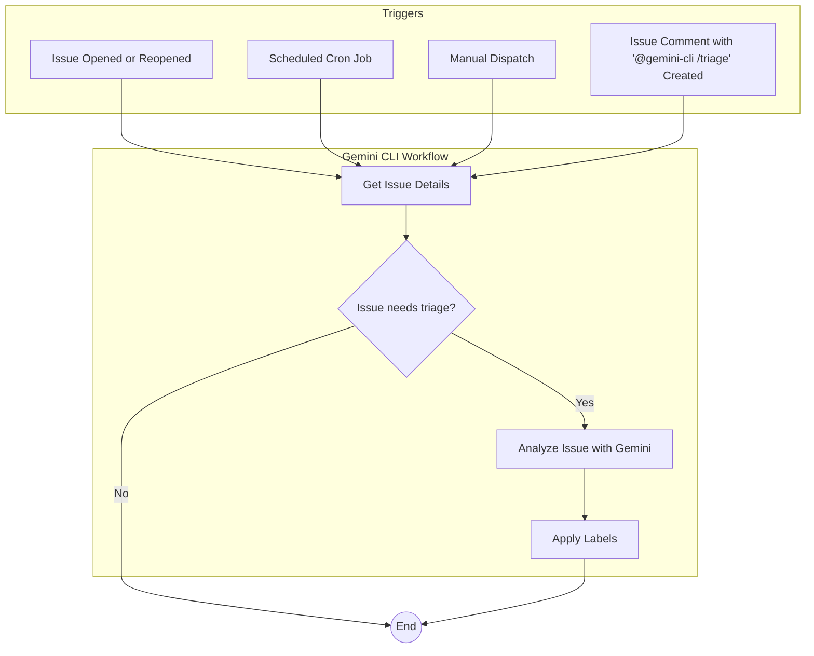

# Issue Triage Workflows

This document describes a comprehensive system for triaging GitHub issues using the Gemini CLI GitHub Action. This system consists of two complementary workflows: a real-time triage workflow and a scheduled triage workflow.

- [Issue Triage Workflows](#issue-triage-workflows)
  - [Overview](#overview)
  - [Features](#features)
  - [Setup](#setup)
    - [Prerequisites](#prerequisites)
    - [Setup Methods](#setup-methods)
  - [Usage](#usage)
    - [Supported Triggers](#supported-triggers)
    - [Real-Time Issue Triage](#real-time-issue-triage)
    - [Scheduled Issue Triage](#scheduled-issue-triage)
    - [Manual Triage](#manual-triage)
  - [Interaction Flow](#interaction-flow)
  - [Configuration](#configuration)
  - [Examples](#examples)
    - [Basic Triage Request](#basic-triage-request)
    - [Automatic Labeling](#automatic-labeling)

## Overview

The Issue Triage workflows provide an automated system for analyzing and categorizing GitHub issues using AI-powered analysis. The system intelligently assigns labels, prioritizes issues, and helps maintain organized issue tracking across your repository.

## Features

- **Dual Workflow System**: Real-time triage for new issues and scheduled batch processing for existing issues
- **Intelligent Labeling**: Automatically applies relevant labels based on issue content and context
- **Priority Assignment**: Categorizes issues by urgency and importance
- **Customizable Logic**: Configurable triage rules and label assignments
- **Error Handling**: Posts helpful comments when triage fails with links to logs
- **Manual Override**: Support for manual triage requests via comments


## Setup

For detailed setup instructions, including prerequisites and authentication, please refer to the main [Getting Started](../../../README.md#quick-start) section and [Authentication documentation](../../../docs/authentication.md).

### Prerequisites

Add the following entries to your `.gitignore` file to prevent issue triage artifacts from being committed:

```gitignore
# gemini-cli settings
.gemini/

# GitHub App credentials
gha-creds-*.json
```

### Setup Methods

To implement this issue triage system, you can utilize either of the following methods:
1. Run the `/setup-github` command in Gemini CLI on your terminal to set up workflows for your repository.
2. Copy the workflow files into your repository's `.github/workflows` directory:

```bash
mkdir -p .github/workflows
curl -o .github/workflows/gemini-dispatch.yml https://raw.githubusercontent.com/google-github-actions/run-gemini-cli/main/examples/workflows/gemini-dispatch/gemini-dispatch.yml
curl -o .github/workflows/gemini-triage.yml https://raw.githubusercontent.com/google-github-actions/run-gemini-cli/main/examples/workflows/issue-triage/gemini-triage.yml
curl -o .github/workflows/gemini-scheduled-triage.yml https://raw.githubusercontent.com/google-github-actions/run-gemini-cli/main/examples/workflows/issue-triage/gemini-scheduled-triage.yml
```

You can customize the prompts and settings in the workflow files to suit your specific needs. For example, you can change the triage logic, the labels that are applied, or the schedule of the scheduled triage.

## Dependencies

This workflow relies on the [gemini-dispatch.yml](../gemini-dispatch/gemini-dispatch.yml) workflow to route requests to the appropriate workflow.

## Usage

### Supported Triggers

The Issue Triage workflows are triggered by:

- **New Issues**: When an issue is opened or reopened (automated triage)
- **Scheduled Events**: Cron job for batch processing (scheduled triage)
- **Manual Dispatch**: Via the GitHub Actions UI ("Run workflow")
- **Issue Comments**: When a comment contains `@gemini-cli /triage`

### Real-Time Issue Triage

This workflow is defined in `workflows/issue-triage/gemini-triage.yml` and is triggered when an issue is opened or reopened. It uses the Gemini CLI to analyze the issue and apply relevant labels.

If the triage process encounters an error, the workflow will post a comment on the issue, including a link to the action logs for debugging.

### Scheduled Issue Triage

This workflow is defined in `workflows/issue-triage/gemini-scheduled-triage.yml` and runs on a schedule (e.g., every hour). It finds any issues that have no labels or have the `status/needs-triage` label and then uses the Gemini CLI to triage them. This workflow can also be manually triggered.

### Manual Triage

You can manually trigger triage by commenting on an issue:

```
@gemini-cli /triage
```

## Interaction Flow



The two workflows work together to ensure that all new and existing issues are triaged in a timely manner.

## Configuration

You can customize the triage workflows by modifying:

- **Triage Logic**: Adjust the AI prompts to change how issues are analyzed
- **Label Assignment**: Configure which labels are applied based on issue content
- **Schedule Frequency**: Modify the cron schedule for batch triage
- **Timeout Settings**: Adjust `timeout-minutes` for complex repositories
- **Custom Filters**: Set criteria for which issues need triage

## Examples

### Basic Triage Request
```
@gemini-cli /triage
```

### Automatic Labeling
The AI will analyze issues and apply labels such as:
- `bug` - for reported bugs and errors
- `enhancement` - for feature requests
- `documentation` - for docs-related issues
- `priority/high` - for urgent issues
- `good first issue` - for beginner-friendly tasks

