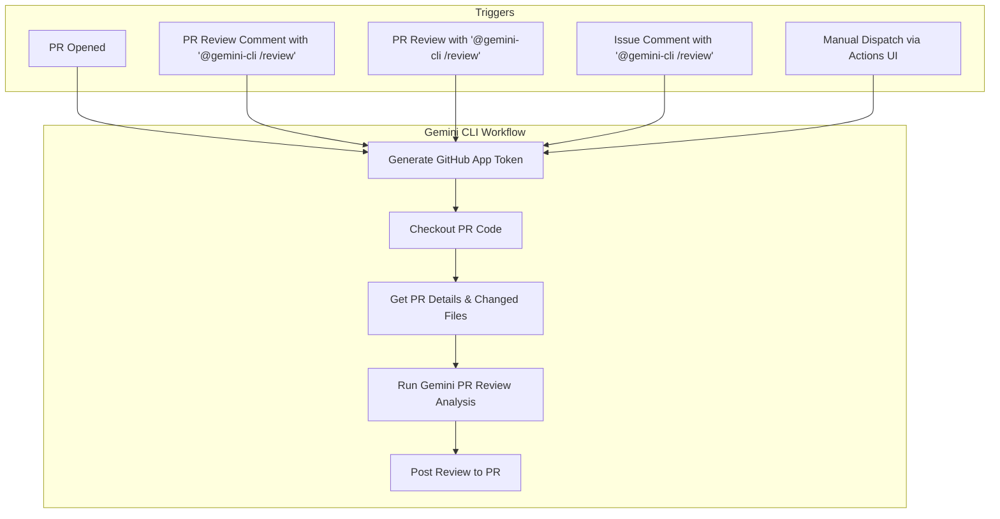

# PR Review with Gemini CLI

This document explains how to use the Gemini CLI on GitHub to automatically review pull requests with AI-powered code analysis.

- [PR Review with Gemini CLI](#pr-review-with-gemini-cli)
  - [Overview](#overview)
  - [Features](#features)
  - [Setup](#setup)
    - [Prerequisites](#prerequisites)
    - [Setup Methods](#setup-methods)
  - [Usage](#usage)
    - [Supported Triggers](#supported-triggers)
  - [Interaction Flow](#interaction-flow)
    - [Automatic Reviews](#automatic-reviews)
    - [Manual Reviews](#manual-reviews)
    - [Custom Review Instructions](#custom-review-instructions)
    - [Manual Workflow Dispatch](#manual-workflow-dispatch)
  - [Review Output Format](#review-output-format)
    - [📋 Review Summary (Overall Comment)](#-review-summary-overall-comment)
    - [Specific Feedback (Inline Comments)](#specific-feedback-inline-comments)
  - [Review Areas](#review-areas)
  - [Configuration](#configuration)
    - [Workflow Customization](#workflow-customization)
    - [Review Prompt Customization](#review-prompt-customization)
  - [Examples](#examples)
    - [Basic Review Request](#basic-review-request)
    - [Security-Focused Review](#security-focused-review)
    - [Performance Review](#performance-review)
    - [Breaking Changes Check](#breaking-changes-check)

## Overview

The PR Review workflow uses Google's Gemini AI to provide comprehensive code reviews for pull requests. It analyzes code quality, security, performance, and maintainability while providing constructive feedback in a structured format.

## Features

- **Automated PR Reviews**: Triggered on PR creation, updates, or manual requests
- **Comprehensive Analysis**: Covers security, performance, reliability, maintainability, and functionality
- **Priority-based Feedback**: Issues categorized by severity (Critical, High, Medium, Low)
- **Positive Highlights**: Acknowledges good practices and well-written code
- **Custom Instructions**: Support for specific review focus areas
- **Structured Output**: Consistent markdown format for easy reading
- **Failure Notifications**: Posts a comment on the PR if the review process fails.

## Setup

For detailed setup instructions, including prerequisites and authentication, please refer to the main [Getting Started](../../../README.md#quick-start) section and [Authentication documentation](../../../docs/authentication.md).

### Prerequisites

Add the following entries to your `.gitignore` file to prevent PR review artifacts from being committed:

```gitignore
# gemini-cli settings
.gemini/

# GitHub App credentials
gha-creds-*.json
```

### Setup Methods

To use this workflow, you can use either of the following methods:
1. Run the `/setup-github` command in Gemini CLI on your terminal to set up workflows for your repository.
2. Copy the workflow files into your repository's `.github/workflows` directory:

```bash
mkdir -p .github/workflows
curl -o .github/workflows/gemini-dispatch.yml https://raw.githubusercontent.com/google-github-actions/run-gemini-cli/main/examples/workflows/gemini-dispatch/gemini-dispatch.yml
curl -o .github/workflows/gemini-review.yml https://raw.githubusercontent.com/google-github-actions/run-gemini-cli/main/examples/workflows/pr-review/gemini-review.yml
```

## Dependencies

This workflow relies on the [gemini-dispatch.yml](../gemini-dispatch/gemini-dispatch.yml) workflow to route requests to the appropriate workflow.

## Usage

### Supported Triggers

The Gemini PR Review workflow is triggered by:

- **New PRs**: When a pull request is opened or reopened
- **PR Review Comments**: When a review comment contains `@gemini-cli /review`
- **PR Reviews**: When a review body contains `@gemini-cli /review`
- **Issue Comments**: When a comment on a PR contains `@gemini-cli /review`
- **Manual Dispatch**: Via the GitHub Actions UI ("Run workflow")

## Interaction Flow

The workflow follows a clear, multi-step process to handle review requests:



### Automatic Reviews

The workflow automatically triggers on:
- **New PRs**: When a pull request is opened

### Manual Reviews

Trigger a review manually by commenting on a PR:

```
@gemini-cli /review
```

### Custom Review Instructions

You can provide specific focus areas by adding instructions after the trigger:

```
@gemini-cli /review focus on security
@gemini-cli /review check performance and memory usage  
@gemini-cli /review please review error handling
@gemini-cli /review look for breaking changes
```

### Manual Workflow Dispatch

You can also trigger reviews through the GitHub Actions UI:
1. Go to Actions tab in your repository
2. Select "Gemini PR Review" workflow
3. Click "Run workflow"
4. Enter the PR number to review

## Review Output Format

The AI review follows a structured format, providing both a high-level summary and detailed inline feedback.

### 📋 Review Summary (Overall Comment)

After posting all inline comments, the action submits the review with a final summary comment that includes:

-   **Review Summary**: A brief 2-3 sentence overview of the pull request and the overall assessment.
-   **General Feedback**: High-level observations about code quality, architectural patterns, positive implementation aspects, or recurring themes that were not addressed in inline comments.


### Specific Feedback (Inline Comments)

The action provides specific, actionable feedback directly on the relevant lines of code in the pull request. Each comment includes:

-   **Priority**: An emoji indicating the severity of the feedback.
    -   🔴 **Critical**: Must be fixed before merging (e.g., security vulnerabilities, breaking changes).
    -   🟠 **High**: Should be addressed (e.g., performance issues, design flaws).
    -   🟡 **Medium**: Recommended improvements (e.g., code quality, style).
    -   🟢 **Low**: Nice-to-have suggestions (e.g., documentation, minor refactoring).
    -   🔵 **Unclear**: Priority is not determined.
-   **Suggestion**: A code block with a suggested change, where applicable.

**Example Inline Comment:**

> 🟢 Use camelCase for function names
> ```suggestion
> myFunction
> ```

## Review Areas

Gemini CLI analyzes multiple dimensions of code quality:

- **Security**: Authentication, authorization, input validation, data sanitization
- **Performance**: Algorithms, database queries, caching, resource usage
- **Reliability**: Error handling, logging, testing coverage, edge cases
- **Maintainability**: Code structure, documentation, naming conventions
- **Functionality**: Logic correctness, requirements fulfillment

## Configuration

### Workflow Customization

You can customize the workflow by modifying:

- **Timeout**: Adjust `timeout-minutes` for longer reviews
- **Triggers**: Modify when the workflow runs
- **Permissions**: Adjust who can trigger manual reviews
- **Core Tools**: Add or remove available shell commands

### Review Prompt Customization

The AI prompt can be customized to:
- Focus on specific technologies or frameworks
- Emphasize particular coding standards
- Include project-specific guidelines
- Adjust review depth and focus areas

## Examples

### Basic Review Request
```
@gemini-cli /review
```

### Security-Focused Review
```
@gemini-cli /review focus on security vulnerabilities and authentication
```

### Performance Review
```
@gemini-cli /review check for performance issues and optimization opportunities
```

### Breaking Changes Check
```
@gemini-cli /review look for potential breaking changes and API compatibility
```
